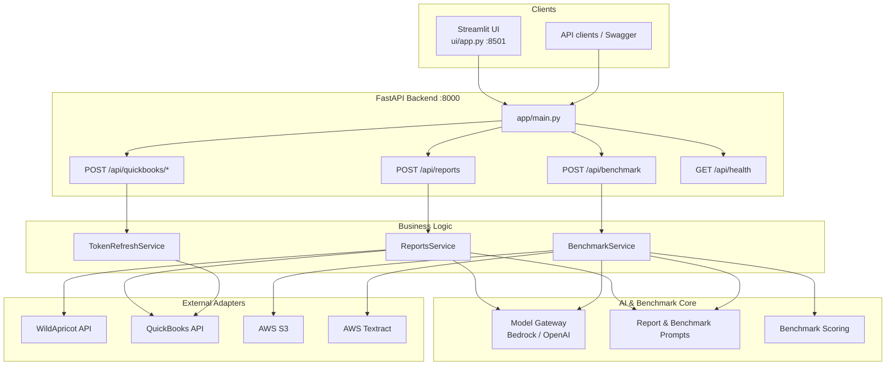
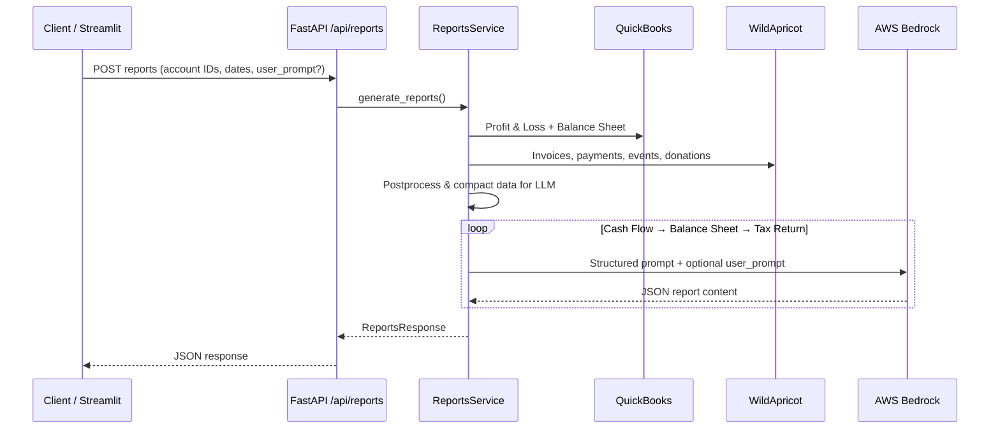

# Report Generation and Benchmarking Solution

An AI-powered report generation and benchmarking solution for nonprofits, built with [GoML.io](https://goml.io). It connects **WildApricot** (membership, events, donations) and **QuickBooks** (accounting), then uses **AWS Bedrock** LLMs to generate structured financial reports and score them against human-prepared reference documents.

---

## Table of Contents

- [What It Does](#what-it-does)
- [Architecture](#architecture)
- [Project Structure](#project-structure)
- [API Endpoints](#api-endpoints)
- [Main Pipelines](#main-pipelines)
- [Local Development](#local-development)
- [Streamlit UI](#streamlit-ui)
- [Configuration](#configuration)
- [Benchmark Reference Documents](#benchmark-reference-documents)
- [Switching to Another Client](#switching-to-another-client)
- [QuickBooks Setup](#quickbooks-setup)
- [WildApricot Setup](#wildapricot-setup)
- [Deployment](#deployment)
- [Testing](#testing)

---

## What It Does

| Capability | Description |
|------------|-------------|
| **Report generation** | Builds Cash Flow, Balance Sheet, and Form 990 (tax return) reports from live QuickBooks + WildApricot data |
| **User prompts** | Optional `user_prompt` on `/api/reports` to steer LLM output across all three reports |
| **Benchmarking** | Compares AI-generated reports against reference PDFs (local `docs/` or S3) and scores accuracy |
| **QuickBooks OAuth** | Auto-refreshes access tokens; credentials can be submitted via API or Streamlit UI |

---

## Architecture



### Report generation flow



### Layer responsibilities

| Layer | Path | Role |
|-------|------|------|
| **HTTP** | `app/api/endpoints/` | REST routes, request validation, auth |
| **Services** | `app/services/` | Orchestrates adapters + LLM for each use case |
| **Adapters** | `app/adapters/` | WildApricot, QuickBooks, Textract, AWS clients |
| **Core** | `app/core/` | LLM gateway, prompts, benchmark logic |
| **Utils** | `app/utils/` | JSON parsing, normalization, caching, S3 helpers |
| **Config** | `app/config/` | Pydantic settings from `.env` |
| **UI** | `ui/` | Streamlit dashboard for reports + benchmark |

---

## Project Structure

```
accountbridge-vcfo/
├── app/                          # FastAPI backend
│   ├── main.py                   # App entry, middleware, route registration
│   ├── api/
│   │   ├── endpoints/            # health, reports, benchmark, quickbooks
│   │   ├── schemas/              # Pydantic request/response models
│   │   └── dependencies/         # Auth (bearer/api_key/jwt) and rate limiting
│   ├── services/
│   │   ├── reports_service.py    # Main report pipeline
│   │   ├── ingestion_service.py  # Internal Textract extraction (used by benchmark)
│   │   ├── llm_service.py        # LLM enhancement for extracted docs
│   │   └── token_refresh_service.py  # Background QuickBooks token refresh
│   ├── adapters/
│   │   ├── wildapricot/          # Membership/event/donation API client
│   │   ├── quickbooks/           # P&L and Balance Sheet API client
│   │   ├── file_extraction/      # Textract extractor factory
│   │   └── llm/                  # LLM response parsing helpers
│   ├── core/
│   │   ├── model_gateway/        # Unified Bedrock/OpenAI interface
│   │   ├── prompts/              # Report, benchmark, Form 990 prompts
│   │   └── benchmark/            # Reference doc loading, scoring, LLM eval
│   ├── utils/                    # Shared helpers (JSON, cache, S3, normalization)
│   ├── config/settings.py        # All environment configuration
│   └── observability/            # Structured logging + request IDs
├── ui/
│   ├── app.py                    # Streamlit UI (reports, benchmark, QB credentials)
│   ├── Dockerfile
│   └── requirements.txt
├── data/
│   ├── reports/                  # Optional saved report outputs
│   └── quickbooks/               # Sample/exported QB JSON
├── tests/                        # Unit + integration tests
├── Dockerfile                    # Backend container
├── docker-compose.yml            # Backend + frontend stack
├── run.py                        # Local dev: uvicorn with reload
├── requirements.txt
├── .env.example                  # Environment template
└── .github/workflows/dev-deploy.yml  # EC2 + ECR deployment
```

---

## API Endpoints

Full request/response reference, auth, errors, and workflows: **[API_README.md](./API_README.md)**.

Interactive docs: `http://localhost:8000/docs` (Swagger UI)

| Method | Path | Auth | Description |
|--------|------|------|-------------|
| GET | `/api/health` | No | Basic health check |
| GET | `/api/health/live` | No | Liveness probe |
| GET | `/api/health/ready` | No | Readiness probe |
| POST | `/api/reports` | Yes | Generate Cash Flow, Balance Sheet, Tax Return |
| GET | `/api/benchmark/reports` | Yes | List available reference PDFs |
| POST | `/api/benchmark` | Yes | Run benchmark against reference docs |
| POST | `/api/quickbooks/credentials` | Yes | Save & validate QuickBooks OAuth credentials |
| POST | `/api/quickbooks/refresh-token` | Yes | Legacy: refresh token only |

### Example: Generate reports

```json
POST /api/reports
{
  "wildapricot_account_id": "497705",
  "quickbooks_realm_id": "9130356628667026",
  "start_date": "2025-01-01",
  "end_date": "2025-12-31",
  "user_prompt": "Emphasize program service revenue and deferred membership dues."
}
```

Optional fields:
- `user_prompt` — steers LLM output for all three reports (highest priority in prompts)
- `wildapricot_data` — cached WA payload to skip re-fetch on QuickBooks retry
- `quickbooks_credentials` — inline QB OAuth credentials for this request only

---

## Main Pipelines

### 1. Reports (`/api/reports`)

1. Fetch **QuickBooks** Profit & Loss and Balance Sheet (prior-year BS for cash flow)
2. Fetch **WildApricot** invoices, payments, contacts, events, registrations, donations
3. Postprocess and compact data for LLM context limits
4. Generate reports **sequentially** via Bedrock:
   - Cash Flow (GAAP indirect method)
   - Balance Sheet (Statement of Financial Position)
   - Tax Return (Form 990 — split into Parts VIII, IX, X, I–VII/XI/XII, reconciliation)
5. Return `ReportsResponse` JSON

### 2. Benchmark (`/api/benchmark`)

1. Accept generated reports in the request body
2. Load reference PDFs from `docs/` or S3 (`BENCHMARK_DOCS_*` settings)
3. Extract reference content via Textract
4. LLM compares AI reports vs reference and produces scorecards
5. Return composite scores for cash flow, financial position, and Form 990

---

## Local Development

### Prerequisites

- Python 3.11+
- AWS credentials with access to S3, Textract, and Bedrock
- WildApricot API key and QuickBooks OAuth credentials

### Setup

```bash
# 1. Clone and create virtual environment
python -m venv venv
venv\Scripts\activate          # Windows
# source venv/bin/activate     # Linux/macOS

# 2. Install dependencies
pip install -r requirements.txt
pip install -r ui/requirements.txt

# 3. Configure environment
copy .env.example .env         # Windows
# cp .env.example .env         # Linux/macOS
# Edit .env with your AWS, WildApricot, QuickBooks, and Bedrock settings

# 4. Configure UI
copy ui\.env.example ui\.env   # or create ui/.env manually
```

**ui/.env** (minimum):

```env
AUTH_METHOD=bearer
BEARER_TOKEN=<same as backend BEARER_TOKEN>
API_BASE_URL=http://localhost:8000
```

### Run

```bash
# Terminal 1 — Backend
python run.py
# → http://localhost:8000  (Swagger at /docs)

# Terminal 2 — Streamlit UI
streamlit run ui/app.py
# → http://localhost:8501
```

### Docker (local or production images)

```bash
docker compose up
# Backend: http://localhost:8000
# Frontend: http://localhost:8501
```

---

## Streamlit UI

The UI (`ui/app.py`) provides four tabs:

| Tab | Purpose |
|-----|---------|
| **Pipeline** | Run reports → store slice → run benchmark (step-by-step) |
| **Reports** | View generated report content |
| **Benchmark** | View benchmark scores and comparisons |
| **Raw JSON** | Inspect full API responses |

**Sidebar configuration:** WildApricot account ID, QuickBooks realm ID, date range, benchmark options.

**Main page (Step 1):** User prompt text area and Run Reports.

**QuickBooks credentials:** If tokens expire, the UI prompts for Client ID, Secret, Refresh Token, and Access Token from the [Intuit OAuth playground](https://developer.intuit.com/app/developer/playground), then retries with credentials sent directly to the API.

---

## Configuration

Copy `.env.example` to `.env`. Key settings:

| Variable | Purpose |
|----------|---------|
| `AWS_REGION`, `BUCKET_NAME` | S3 + Textract |
| `LLM_PROVIDER`, `LLM_MODEL` / `MODEL_ID` | Bedrock model (use full inference profile ARN if applicable) |
| `EXTRACTOR_TYPE` | `AWS_textract` (default) |
| `AUTH_METHOD`, `BEARER_TOKEN` | API auth (`none`, `bearer`, `api_key`, `jwt`) |
| `WILDAPRICOT_*` | WildApricot API credentials |
| `QUICKBOOKS_*` | QuickBooks OAuth and realm ID |
| `BENCHMARK_DOCS_SOURCE` | `local` or `s3` for reference PDFs |
| `BENCHMARK_DOCS_LOCAL_PATH` | Local folder for reference PDFs (default `docs`) |
| `BENCHMARK_DOCS_S3_BUCKET` | S3 bucket when source is `s3` |
| `BENCHMARK_DOCS_S3_PREFIX` | S3 key prefix for client/manual reports |

**Important:** `LLM_MODEL` / `MODEL_ID` must be a valid Bedrock model or inference profile ARN. A truncated or wrong ID causes all report LLM calls to fail with `ValidationException: The provided model identifier is invalid`.

After changing `.env`, **restart the backend** — settings are cached at startup.

---

## Benchmark Reference Documents

Benchmarking compares generated reports against human-prepared PDFs. Those reference files are **not** uploaded through the API; they are loaded from storage configured in `.env`.

### Where they are stored

| Source | Setting | Location |
|--------|---------|----------|
| **Local** | `BENCHMARK_DOCS_SOURCE=local` | Folder from `BENCHMARK_DOCS_LOCAL_PATH` (default: project `docs/`) |
| **S3** | `BENCHMARK_DOCS_SOURCE=s3` | `s3://{BENCHMARK_DOCS_S3_BUCKET}/{BENCHMARK_DOCS_S3_PREFIX}` |

Example for S3:

```env
BENCHMARK_DOCS_SOURCE=s3
BENCHMARK_DOCS_S3_BUCKET=goml-accountbridge-benchmarking-docs
BENCHMARK_DOCS_S3_PREFIX=manual_reports/
```

Only PDF filenames that match the expected naming patterns are listed (Form 990, Statement of Cash Flows, Statement of Financial Position). Use `GET /api/benchmark/reports` or the UI reference-document picker to see what the backend found.

Place (or upload) each client's filed/reference PDFs in that local folder or S3 prefix before running a benchmark.

---

## Switching to Another Client

Report generation and benchmarking are **per client**. To work with a different nonprofit / company, update `.env` (and restart the backend):

| What to change | Env vars / notes |
|----------------|------------------|
| **WildApricot account** | `WILDAPRICOT_API_KEY`, `WILDAPRICOT_ACCOUNT_ID` |
| **QuickBooks company** | `QUICKBOOKS_CLIENT_ID`, `QUICKBOOKS_CLIENT_SECRET`, `QUICKBOOKS_REFRESH_TOKEN`, `QUICKBOOKS_ACCESS_TOKEN`, `QUICKBOOKS_REALM_ID` |
| **Benchmark reference PDFs** | Point `BENCHMARK_DOCS_*` at that client's local `docs/` folder or S3 prefix (different client → different PDFs) |

Also set the matching **WildApricot Account ID** and **QuickBooks Realm ID** in the Streamlit sidebar (or in the `/api/reports` request body). Fresh QuickBooks tokens can be submitted via the UI or `POST /api/quickbooks/credentials` instead of editing `.env` each time.

---

## QuickBooks Setup

1. Go to [developer.intuit.com](https://developer.intuit.com) → your app → **Keys & OAuth**
2. Add redirect URI: `https://developer.intuit.com/v2/OAuth2Playground/RedirectUrl`
3. Open the [OAuth 2.0 Playground](https://developer.intuit.com/app/developer/playground) → **Get Tokens**
4. Copy **Client ID**, **Client Secret**, **Refresh Token**, **Access Token**, and **Realm ID** into `.env`:

```env
QUICKBOOKS_CLIENT_ID=...
QUICKBOOKS_CLIENT_SECRET=...
QUICKBOOKS_REFRESH_TOKEN=RT1-...
QUICKBOOKS_ACCESS_TOKEN=...
QUICKBOOKS_REALM_ID=...
QUICKBOOKS_SANDBOX_BASE_URL=https://sandbox-quickbooks.api.intuit.com
# For production QuickBooks:
# QUICKBOOKS_SANDBOX_BASE_URL=https://quickbooks.api.intuit.com
```

5. Alternatively, submit credentials via:
   - **Streamlit UI** — QuickBooks credentials form on token expiry
   - **API** — `POST /api/quickbooks/credentials`

The backend **auto-refreshes** access tokens every ~50 minutes via `TokenRefreshService`. No manual OAuth is needed after initial setup.

See also: `app/adapters/quickbooks/README.md` for adapter-level details.

---

## WildApricot Setup

```env
WILDAPRICOT_API_KEY=your-admin-api-key
WILDAPRICOT_ACCOUNT_ID=497705
```

The adapter fetches invoices, payments, contacts, events, event registrations, and donations for the reporting period.

---

## Deployment

Production deploys via **GitHub Actions** on push to `dev`:

```
.github/workflows/dev-deploy.yml
```

**Pipeline steps:**
1. Build backend Docker image → push to **AWS ECR** (`accountbridge-goml-api`)
2. Build frontend Docker image → push to ECR (`accountbridge-goml-frontend`)
3. SSH to **EC2**, write `.env` files from GitHub secrets
4. `docker compose pull && docker compose up -d`

**EC2 layout:**

```
/home/ubuntu/accountbridge/
├── .env                  # Backend secrets (from BACKEND_ENV secret)
├── ui/.env               # UI secrets (from UI_ENV secret)
├── docker-compose.yml
└── data/                 # Persistent report cache
```

**Required GitHub secrets:** `AWS_ROLE_ARN`, `AWS_ACCOUNT_ID`, `EC2_HOST`, `EC2_SSH_KEY`, `BACKEND_ENV`, `UI_ENV`

**Deployed URLs:** Configure `API_BASE_URL` in `ui/.env` to point at the EC2 backend (e.g. `http://<ec2-ip>:8000`). Ensure `BEARER_TOKEN` matches on both backend and UI.

The app also exposes a **Mangum** Lambda handler in `app/main.py` for optional serverless deployment, but the active CI/CD path is **EC2 + Docker**.

---

## Testing

```bash
# Unit tests
pytest tests/unit -v

# Integration tests (requires running app / AWS)
pytest tests/integration -v

# OpenAPI schema validation
pytest tests/test_openapi.py -v
```

---

